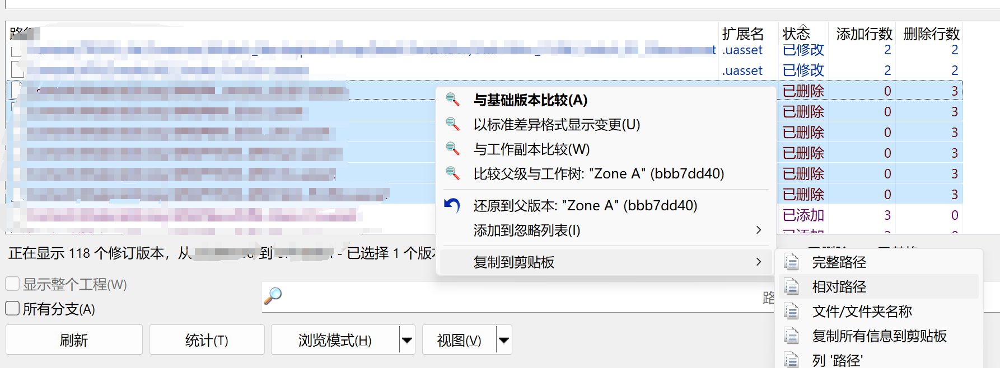

# 技术支持
B站个人主页：
https://space.bilibili.com/381317561

# 项目说明

此项目是为了再有多个库的时候（且多个库并不是一个UE项目，譬如分为美术库和主库，美术库和主库除了部分文件夹的资产一样，其余的都不一样），进行删除同步的。

修改，增加的同步，都可以用版本控制软件对比出区别，然后导出区别。覆盖到项目里。

但是删除就无法通过这个操作同步了。所以我才开发了这个项目。

# 免责声明
在您执行本程序进行文件删除操作之前，请仔细阅读并理解以下内容。一旦执行了删除操作，可能会导致数据永久性丢失，并且可能无法恢复。

此项目会按照日志信息删除文件。操作风险较高。使用时请一定要确认自己完全了解本程序。所有后果自负。

删除文件说明：
此程序需要连同根目录一起放到项目根目录中。如：

UE项目位置：

D:\YouUEProject\YouUEProject.uproject

此项目位置应为：

D:\YouUEProject\SyncDelete\SyncDelete.uproject

此程序为了防止误删，删除是按相对路径设置的。如上的路径，此程序只能删除D:\YouUEProject\下的文件。
请在使用此程序前，先把D:\YouUEProject\进行版本控制。防止操作失误造成误删。

风险认知：请确保您完全明白即将进行的删除操作所带来的后果。删除的数据、文件或程序可能不可逆转地丢失。

备份重要信息：强烈建议在开始删除过程前对所有关键数据进行全面备份。对于因未备份而导致的信息损失，我们不承担任何责任。

谨慎操作：请准确选择需要被删除的对象，避免误删其他重要资料。

技术支持：如果您不确定如何安全地完成删除步骤，建议联系专业人士寻求帮助。

个人责任：用户自行承担由此类操作引起的所有后果和风险。本声明旨在提醒用户注意潜在风险，但并不能涵盖所有可能出现的情况。

通过继续进行删除操作，即表示您已阅读上述免责声明，并同意接受其中所列条款。若不同意，请立即停止相关操作。

# 为什么使用UE开发？
本来我打算用java开发来着。但考虑到运行java项目。需要再计算机安装JRE。并不是所有UE开发者都有JRE。

所以为了让UE开发者可以免配置运行。所以就用UE开发了这个工具。

# 为什么不做成UE的编辑器插件呢？

因为打开项目后，文件被UE占用。无法通过windows的删除来进行删除。通过UE编辑器自带的安全删除的话，会加载引用，速度会相当慢。
所以就搞出了这个项目。

而且，此项目还打算打包成exe文件，单独运行。

# 使用方法 
使用方法，把SyncDelete文件夹放入项目根目录里。然后用UE5 5.3版本打开此项目。

注意：需要自己编译一下，请确保电脑可以创建UE C++项目和打包UE项目。
如果是其他版本的UE引擎（因为有部分蓝图开发，所以必须是UE5.3及以上版本），请尝试编译一下。不确保能编译成功。只确保UE5.3可以编译成功。
编译方法：https://www.bilibili.com/video/BV1Jk4y157mh

从其他库中，打开日志文件（下图用TortoiseGit查看的）。然后拷贝相对路径。

之后运行SyncDelete项目。把相对路径拷贝进去。删除即可。

此程序本来打算打包成EXE出来，方便使用来着。但是目前打包成EXE后，无法删除文件。所以暂时请使用UE项目来进行删除同步。

